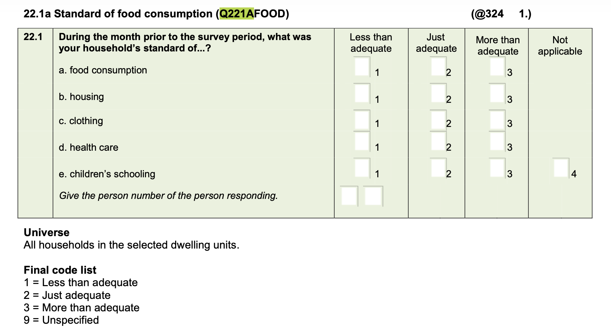

```{r setup, include=FALSE}

# Defining text size in various chunks 
def.chunk.hook  <- knitr::knit_hooks$get("chunk")
knitr::knit_hooks$set(chunk = function(x, options) {
  x <- def.chunk.hook(x, options)
  ifelse(options$size != "normalsize", paste0("\\", options$size,"\n\n", x, "\n\n \\normalsize"), x)
})

## libraries - data management
library(tidyverse)
library(skimr)
library(readxl)
library(janitor)
library(haven)

## libraries - tables
library(knitr)
library(kableExtra)
library(stargazer)
library(gt)

## libraries - plots
library(ggthemes)

## Google scholar
library(scholar)
library(tm)
library(wordcloud)
library(RColorBrewer)


set.seed(42) # randomness to get same results
```

## References

-   We are still working mostly with @wickham2023r4ds
-   Each of the chapters is fairly easy reading
-   This week, I will mostly look at chapters 9-11, 19
-   Try to go through those, yes, even if you do not want to use R, there is some very good advice in it.
- We will also make use of `kableExtra`, the following offers some  [examples](https://r-graph-gallery.com/package/kableExtra.html) 

## Packages 

- The ones from before, most likely
- `kbl` in `knitr` [@knitr] and `kableExtra` [@kableExtra] and can be used with `skim`
-`gt` [@gt] is also good for simple tables, can be combined with `skim` 
- `startgazer` [@gazer] is often easy to use, but requires numeric data (does not work with factors)


## Additional references

- `janitor` [@janitor] has some nice table and factor features
- `forcats` [@forcats], which is part of tidyverse, also has some nice factor features that are useful for table building
- `ggplot2` [@ggplot2] for plots is part of the `tidyverse`
- `ggthemes` [@ggthemes] offers a bit more for plots.

## Data

- Living Conditions Survey [@lcs_2014_2015]
- Others?

## Today's objectives


1.  Join data 
1.  Build simple tables
1.  Build basic plots

# Joining

## Merge concepts

- The [commands](https://dplyr.tidyverse.org/reference/mutate-joins.html)

## Read in person data

```{r}
#| label: person_data

person_df <- read_dta('../Data/lcs/lcs-2014-2015-persons-final-v1.dta') |>
  select(UQNO,
         PERSONNO,
         Q12SEX,
         Q14AGE) |>
  clean_names()

# cound number of children 5 or under
hh_child5_df <- person_df |>
  group_by(uqno) |>
  mutate(child5 = 1*(q14age<= 5)) |>
  summarize(children_under5 = sum(child5),
            .groups = 'drop')

```

## Food adequacy question

- Before reading in household information


## Read in household data

```{r}
#| label: house_data

household_df <- read_dta('../Data/lcs/lcs-2014-2015-households-v1.dta') |>
  select(UQNO,
         expenditure_inkind,
         income_inkind, 
         province_code,
         Q221AFOOD,
         hhsize) |>
  clean_names() |>
  mutate(food_adeq = as_factor(q221afood))

```

## COICOP

- Before reading in expenditure category information...
- To learn more about the development of these [codes](https://unstats.un.org/unsd/classifications/unsdclassifications/COICOP_2018_-_pre-edited_white_cover_version_-_2018-12-26.pdf)
- To see a basic code [list](https://webapps.ilo.org/CPI/doc/coicop.pdf)
- We are just focusing on food, but that means dropping alcohol

## Read in and create (food) expenditure data

```{r}
#| label: total_data

total_df <- read_dta('../Data/lcs/lcs-2014-2015-total-v1.dta') |>
  clean_names() |>
  # I already checked to see the names to select
  select(uqno,
         secondary_group,
         third_group,
         valueannualized_adj) |>
  mutate(sg = as.numeric(secondary_group),
         tg = as_factor(third_group)) |>
  # keeps only food consumption
  filter(sg == 11) |>
  droplevels()
  
food_exp_df <- total_df |>
  group_by(uqno) |>
  summarise(food_expend = sum(valueannualized_adj),
            .groups = 'drop') 
```

## Before merging 

- Data dimensions

```{r}
#| label: dimensions
#| dependson: [house_data, person_data]
#| results: markup

print(paste("Observations in household_df", 
      " = ", dim(household_df)[1]))

print(paste("Observations in person_df",
       " = ", dim(person_df)[1]))

print(paste("Observations in hh_child5_df", 
      " = ", dim(hh_child5_df)[1]))

print(paste("Observations in food_exp_df", 
      " = ", dim(food_exp_df)[1]))

#households.to.persons <- left_join(persons,households)

```

## Merging (households to persons)

- Want observations determined by number of persons

```{r}
#| label: dimensions_h2p
#| dependson: [house_data, person_data]
#| results: markup

house_2_pers_df <- 
  left_join(person_df,household_df,
            by = "uqno")

print(paste("Observations in house_2_pers_df", 
      " = ", dim(house_2_pers_df)[1]))

```

## Merging (households to persons)

- Want observations determined by number of households

```{r}
#| label: dimensions_p2h_wrong
#| dependson: [house_data, person_data]
#| results: markup

pers_2_house_wrong <- 
  right_join(person_df,household_df,
             by = "uqno")

print(paste("Observations in pers_2_house_wrong", 
      " = ", dim(pers_2_house_wrong)[1]))
```

- What is wrong here?
- The `left` is not properly limited

## Again merging households to persons

- Choose a person in the household
- Like the head of the household?


```{r}
#| label: dimensions_p2h
#| dependson: [house_data, person_data]
#| results: markup

# Note the change in structure, when piped?
pers_2_house_df <- person_df |>
  filter(personno == 1) |>
  #person_df is already there
  right_join(household_df,
             by = "uqno")

print(paste("Observations in pers_2_house_df", 
      " = ", dim(pers_2_house_df)[1]))
```


## Add in the food expenditure


```{r}
#| label: dimensions_p2hf
#| dependson: [dimensions_p2h, total_data]
#| results: markup

pers_house_food_df <- pers_2_house_df |>
  right_join(food_exp_df,
             by = "uqno")

print(paste("Observations in pers_house_food_df", 
      " = ", dim(pers_house_food_df)[1]))
```

- Hmm, is this what I want?

## A slightly different merge?

```{r}
#| label: dimensions_p2hf_left
#| dependson: [dimensions_p2h, total_data]
#| results: markup

pers_house_food_dfl <- pers_2_house_df |>
  left_join(food_exp_df,
             by = "uqno")


```

- Or, is this the one I want?
- What is the difference?
- How does one decide?

# Tables

## Some thoughts

- I have shown many simple tables
- What is a table?
    - It is a collection of numbers
    - Similar to a data.frame or tibble
    - Likely has row and col names
- I often use `kbl()` and `kableExtra`
- Often, I build the tibble with what I want
- But, there are some useful packages

## Using stargazer (code fails)

```{r}
#| eval: false

# using "left" data
# Piping all the way through
gaz_table <- pers_house_food_dfl |>
  select(q14age, 
         expenditure_inkind, 
         income_inkind,
         food_expend) 

stargazer(gaz_table, 
            type = "html",
            note="Simple descriptives of continuous data")


```


## Stargazer table (fails)

```{r}
#| label: gazer_table
#| dependson: dimensions_p2hf_left
#| results: asis
#| echo: false

# using "left" data
# Piping all the way through
gaz_table <- pers_house_food_dfl |>
  select(q14age, 
         expenditure_inkind, 
         income_inkind,
         food_expend) 

stargazer(gaz_table, 
            type = "html",
            note="Simple descriptives of continuous data")

```

- Why the fail?
- `stargazer` has a very specific input specification..
- `stargazer` has many options that yield nice tables
- This is a default descriptive stats table, not too exciting looking, but all there

## Stargazer that works? (code)

```{r}
#| eval: false

# using "left" data
# Piping all the way through
gaz_table <- pers_house_food_dfl |>
  select(q14age, 
         expenditure_inkind, 
         income_inkind,
         food_expend) |>
  as.data.frame()

stargazer(gaz_table, 
            type = "html",
            note="Simple descriptives of continuous data")

```

## Stargazer that works? (results)

```{r}
#| label: gazer_table_works
#| dependson: dimensions_p2hf_left
#| results: asis
#| echo: false

# using "left" data
# Piping all the way through
gaz_table <- pers_house_food_dfl |>
  select(q14age, 
         expenditure_inkind, 
         income_inkind,
         food_expend)  |>
  as.data.frame()

stargazer(gaz_table, 
            type = "html",
            note="Simple descriptives of continuous data")

```

## That table is really too big

- There are .css options to change the table size or make it scroll
- If looking at this in normal html, it might look ok?
- Maybe a reason to just build what is wanted?
- Do we need all this detail?
- More generally, to make better use of [stargazer](https://cloud.r-project.org/web/packages/stargazer/vignettes/stargazer.pdf)

## Choose less information (in `stargazer`)

```{r}
#| label: gazer_table_smaller
#| dependson: gazer_table_works
#| results: asis

stargazer(gaz_table, 
          summary.stat = c("n","mean","sd"),
          type = "html",
          note="Simple descriptives of continuous data")

```

## Use `gt()`

- Names can be made better via select
- Pipe the data through a `format` type command

```{r}
#| label: gt_table
#| dependson: gazer_table_works
#| results: asis

gaz_table |>
  skim() |>
  select(variable = skim_variable,
         missing = n_missing, 
         mean = numeric.mean, 
         sd = numeric.sd, 
         median = numeric.p50) |>
  gt(caption = "Simple descriptive statistics for numeric data") |>
  fmt_number(decimals = 2)
```

## Use `kbl()` (code)

- We can skim, as above, or create our own information; skim is probably easier
- The styling features do no show up on my slides
- Probably, we want to change the rownames, too

```{r}
#| eval: false

gaz_table |>
  skim() |>
  select(variable = skim_variable,
         missing = n_missing, 
         mean = numeric.mean, 
         sd = numeric.sd, 
         median = numeric.p50) |>
  kbl(caption = "Simple descriptive statistics for numeric data",
      digits = 2) |>
  kable_styling(
    bootstrap_options = c("striped", "hover", "condensed", "responsive")
  )
```

## Use `kbl()` results

```{r}
#| label: kbl_table
#| dependson: gazer_table_works
#| results: asis
#| echo: false

gaz_table |>
  skim() |>
  select(variable = skim_variable,
         missing = n_missing, 
         mean = numeric.mean, 
         sd = numeric.sd, 
         median = numeric.p50) |>
  kbl(caption = "Simple descriptive statistics for numeric data",
      digits = 2) |>
  kable_styling(
    bootstrap_options = c("striped", "hover", "condensed", "responsive")
  )
```

## What to do about factors?

- Create numeric versions of these
    - Means will be proportions
    - But, dummies must be correctly defined
- Create proportions more directly
- Should numeric and factor be combined? 
    - They often are in economics tables
    - Not obvious they should be
    - Different types of data
    
## Create some dummies

```{r}
#| label: dstats
#| dependson: dimensions_p2hf_left

dstats_df <- pers_house_food_dfl |>
  # Just keeping the dummies, we have already seen the rest of the numerics...
  transmute(male = 1*(q12sex==1),
         female = 1*(q12sex==2),
         wc = 1*(province_code == 1),
         ec = 1*(province_code == 2),
         nc = 1*(province_code == 3),
         fs = 1*(province_code == 4),
         kzn = 1*(province_code == 5),
         nw = 1*(province_code == 6),
         gp = 1*(province_code == 7),
         mp = 1*(province_code == 8),
         lp = 1*(province_code == 9),
         lessthan = 1*(food_adeq == "Less than adequate"),
         adequate = 1*(food_adeq == "Just adequate"),
         morethan = 1*(food_adeq == "More than adequate")) 


```

## Print the table with `kbl` or `gt` (code)

```{r}
#| eval: false

dstats_df |>
  skim() |>
  select(variable = skim_variable,
         missing = n_missing, 
         mean = numeric.mean, 
         sd = numeric.sd, 
         median = numeric.p50) |>
  kbl(caption = "Simple descriptive statistics for dummy data",
      digits = 2) |>
  kable_styling(
    bootstrap_options = c("striped", "hover", "condensed", "responsive")
  )
```


## Print the table with `kbl` or `gt` (results)

```{r}
#| label: dstat_table
#| dependson: dstats
#| results: asis
#| echo: false

dstats_df |>
  skim() |>
  select(variable = skim_variable,
         missing = n_missing, 
         mean = numeric.mean, 
         sd = numeric.sd, 
         median = numeric.p50) |>
  kbl(caption = "Simple descriptive statistics for dummy data",
      digits = 2) |>
  kable_styling(
    bootstrap_options = c("striped", "hover", "condensed", "responsive")
  )
```

## Some final thoughts

- These tables are too big to fit the slides
- They should be fine in the full html version
- One probably needs to think about medians a bit? 
- Also, what would one do, if the table were to be split by province or sex?
    - One could create separate skims
    - The skims could be tabled and grouped by province or sex
    - Probably, one would find it easier to build the data
    
# Plots

## Thinking about plots

- Plotting in base R is actually pretty easy, and I do it fairly often
- R thinks in 'layers'
    - Draw the plot (R chooses based on type of data)
    - Add additional ones, if needed
    - Label the figure
    - Create a legend
- `ggplot` thinks the same way
    - Sometimes easier to use
    - Sometimes less so (in my view)
- Obviously, there are plenty other plotting packages

## The `ggplot` command

- It is part of `tidvyerse`, so designed to work like piping
- However, plot layers are ADDED
- Must have an `aes` or aesthetics component
- Must have a plot type
- AND, the data needs to match the plot type

## A simple boxplot 

```{r}
#| label: bxplot
#| dependson: dimensions_p2hf_left

pers_house_food_dfl |>
  select(food_expend, hhsize, food_adeq) |>
  mutate(mfood_pc = (food_expend/12)/hhsize) |>
  ggplot(aes(x=food_adeq,y=mfood_pc)) +
  geom_boxplot()
```

## Slightly prettier (code)

```{r}
#| eval: false

pers_house_food_dfl |>
  select(food_expend, hhsize, food_adeq) |>
  mutate(mfood_pc = (food_expend/12)/hhsize) |>
  ggplot(aes(x=food_adeq,y=mfood_pc)) +
  geom_boxplot() +
    labs(
  x = "Household food adequacy response",
  y = "Monthly food expenditure per capita",
  title = "Boxplot of monthly food expenditure per capita across reported household food adequacy",
  caption = "Source: LCS 2014-15")
```

## Slightly prettier 

```{r}
#| label: bxplot_pretty
#| dependson: dimensions_p2hf_left
#| echo: false

pers_house_food_dfl |>
  select(food_expend, hhsize, food_adeq) |>
  mutate(mfood_pc = (food_expend/12)/hhsize) |>
  ggplot(aes(x=food_adeq,y=mfood_pc)) +
  geom_boxplot() +
  labs(
  x = "Household food adequacy response",
  y = "Monthly food expenditure per capita",
  title = "Boxplot of monthly food expenditure per capita across reported household food adequacy",
  caption = "Source: LCS 2014-15")
```

- We might want to drop the unspecified value

## Revise the data

```{r}
#| label: plot_data
#| dependson: dimensions_p2hf_left

plot_df <- pers_house_food_dfl |>
  select(food_expend, 
         expenditure_inkind, 
         hhsize, 
         q12sex) |>
  # We lose observations here, i think
  mutate(ln_mfoodpc = log((food_expend/12)/hhsize),
         ln_mpc = log(expenditure_inkind/12),
         male = as_factor(q12sex)) 
```

## Scatterplot and nonlinear fit

```{r}
#| label: scatter1
#| dependson: plot_data

plot_df |> 
  ggplot(aes(x=ln_mpc, 
             y=ln_mfoodpc)) + 
  geom_point() +
  geom_smooth() +
  labs(x = "Log per capita monthly expenditure",
       y = "Log per capita monthly food expenditure",
       title = "Relationship between montly total and food expenditure in logs",
       caption = "Source: LCS 2014-15")
```

## Splitting by sex of household head (code)


```{r}
#| eval: false

plot_df |> 
  drop_na() |>
  ggplot(aes(x=ln_mpc, 
             y=ln_mfoodpc,
             color = male)) + 
  geom_point() +
  geom_smooth() +
  labs(x = "Log per capita monthly expenditure",
       y = "Log per capita monthly food expenditure",
       title = "Relationship between montly total and food expenditure in logs across the sex of household head",
       caption = "Source: LCS 2014-15")
```


## Splitting by sex of household head (plot)

```{r}
#| label: scatter2
#| dependson: plot_data
#| echo: false

plot_df |> 
  drop_na() |>
  ggplot(aes(x=ln_mpc, 
             y=ln_mfoodpc,
             color = male)) + 
  geom_point() +
  geom_smooth() +
  labs(x = "Log per capita monthly expenditure",
       y = "Log per capita monthly food expenditure",
       title = "Relationship between montly total and food expenditure in logs across the sex of household head",
       caption = "Source: LCS 2014-15")
```


- The legend has a stupid name
- Also, I do not really like the background

## Changing the background (code)

```{r}
#| eval: false

plot_df |> 
  drop_na() |>
  ggplot(aes(x=ln_mpc, 
             y=ln_mfoodpc,
             color = male)) + 
  geom_point() +
  geom_smooth() +
  labs(x = "Log per capita monthly expenditure",
       y = "Log per capita monthly food expenditure",
       title = "Relationship between montly total and food expenditure in logs across the sex of household head",
       caption = "Source: LCS 2014-15") +
  theme_bw()
```


## Changing the background (plot)

```{r}
#| label: scatter3
#| dependson: plot_data
#| echo: false

plot_df |> 
  drop_na() |>
  ggplot(aes(x=ln_mpc, 
             y=ln_mfoodpc,
             color = male)) + 
  geom_point() +
  geom_smooth() +
  labs(x = "Log per capita monthly expenditure",
       y = "Log per capita monthly food expenditure",
       title = "Relationship between montly total and food expenditure in logs across the sex of household head",
       caption = "Source: LCS 2014-15") +
  theme_bw()
```

- There are many [themes](https://ggplot2-book.org/themes.html)

## Fixing that legend (code)

- Also, changing the theme, again

```{r}
#| eval: false

plot_df |> 
  drop_na() |>
  ggplot(aes(x=ln_mpc, 
             y=ln_mfoodpc,
             color = male)) + 
  geom_point() +
  geom_smooth() +
  labs(x = "Log per capita monthly expenditure",
       y = "Log per capita monthly food expenditure",
       title = "Relationship between montly total and food expenditure in logs across the sex of household head",
       caption = "Source: LCS 2014-15",
       color = "Sex") +
  theme_solarized()
```


## Changing the background (plot)

```{r}
#| label: scatter4
#| dependson: plot_data
#| echo: false

plot_df |> 
  drop_na() |>
  ggplot(aes(x=ln_mpc, 
             y=ln_mfoodpc,
             color = male)) + 
  geom_point() +
  geom_smooth() +
  labs(x = "Log per capita monthly expenditure",
       y = "Log per capita monthly food expenditure",
       title = "Relationship between montly total and food expenditure in logs across the sex of household head",
       caption = "Source: LCS 2014-15",
       color = "Sex") +
  theme_solarized()
```

# A Sidestep

## Some different packages

- `scholar`
- `tm`
- `wordcloud`
- `RColorBrewer`


## Getting publications

```{r}
#| label: scholar1

# Google Scholar ID
id <- "aQuqTmcAAAAJ"

# Fetch all publications
publications <- get_publications(id)

# Extract the titles
titles <- publications$title

# Process and clean the text data for analysis
docs <- Corpus(VectorSource(titles))
docs <- tm_map(docs,
               content_transformer(tolower))
docs <- tm_map(docs, 
               removePunctuation)
docs <- tm_map(docs, 
               removeWords, 
               stopwords("english"))

```

## Doing some string cleaning

```{r}
#| label: scholar2
#| dependson: scholar1


# Optional: Remove specific common terms from your field
docs <- tm_map(docs, 
               removeWords, 
               c("south", "africa", "african",
                 "ethiopia","ethiopian"))

# Create a term-document matrix and generate the plot
dtm <- TermDocumentMatrix(docs)
matrix <- as.matrix(dtm)
df <- data.frame(word = names(sort(rowSums(matrix), decreasing = TRUE)), 
                 freq = sort(rowSums(matrix), decreasing = TRUE))
```

## Topics in my publications

```{r}
#| label: scholar3
#| dependson: [scholar1, scholar2]
#| fig.cap: "My publications word cloud"

wordcloud(words = df$word, freq = df$freq,
          max.words = 50, 
          colors = brewer.pal(8, "Spectral"))


```


## References
